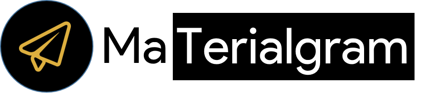
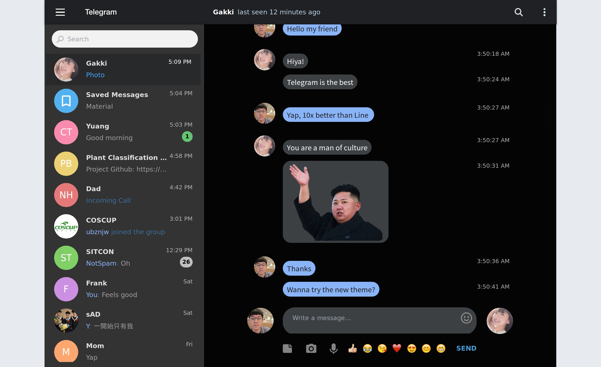
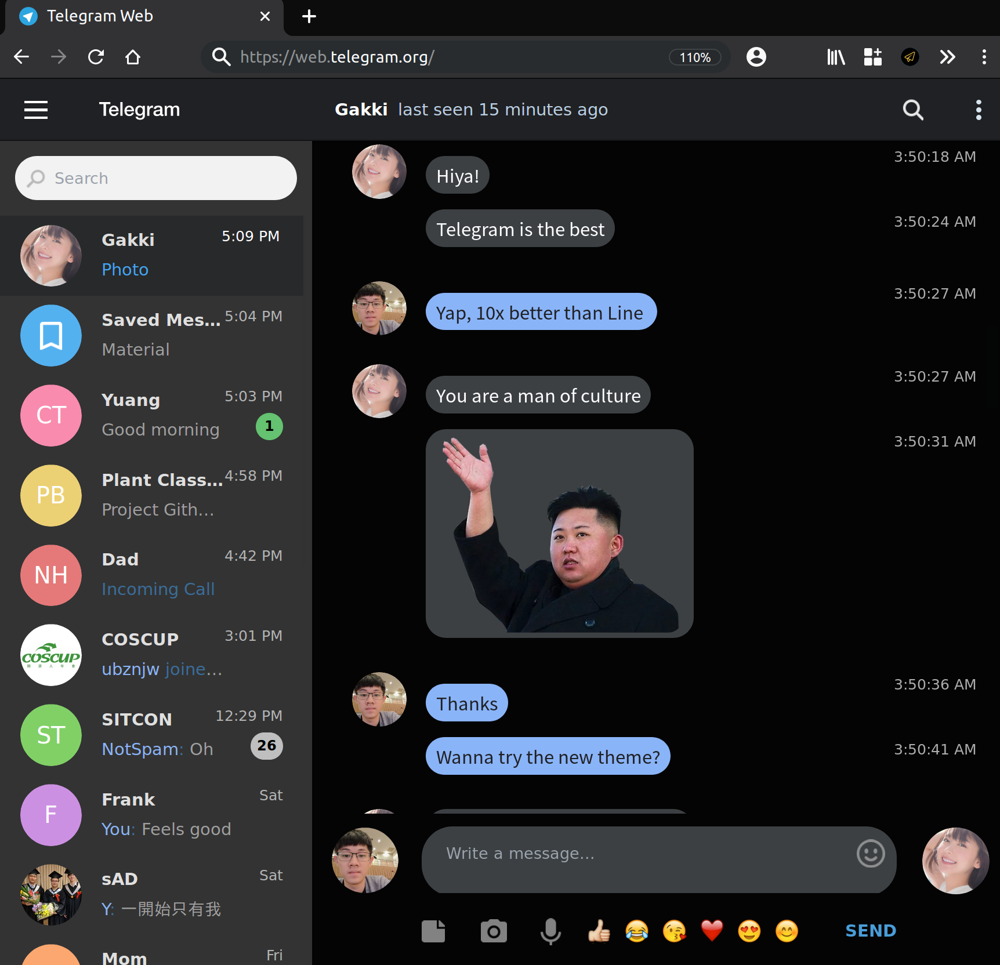
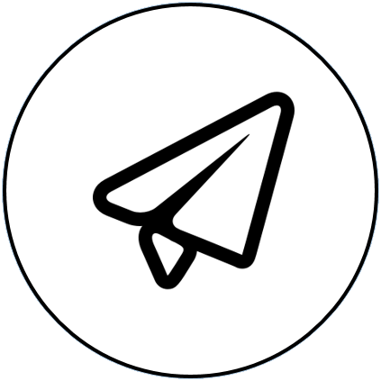
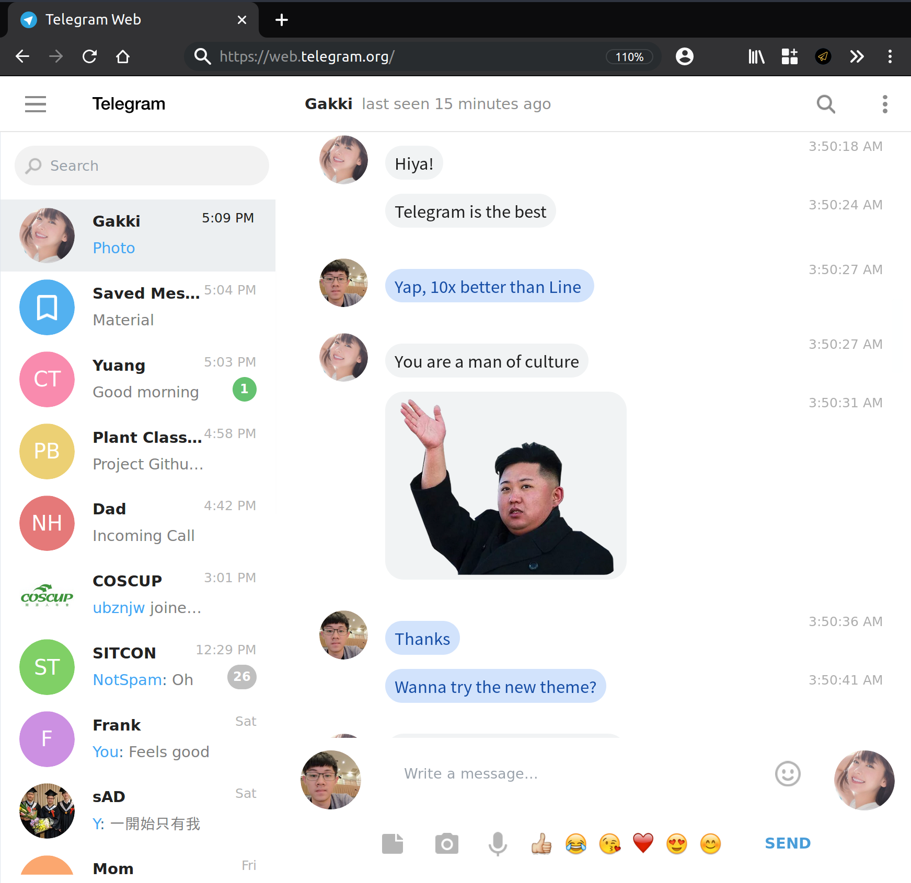

*Experience Telegram with the new Material Design, dark and light theme*

## Install Extensions

|Platform|Link|
|:-:|:-:|
|[](#TODO)| [Chrome Extension](#TODO)|
|[](https://addons.mozilla.org/en-GB/firefox/addon/)| [Firefox Extension](https://addons.mozilla.org/en-GB/firefox/addon/)|

## Demo


## About MaTerialgram
This project is inspired by the recently redesign of Android Message Web. Aims to redisgn Telgram web with the new Material design guideline (or so-called Material Design 2). 

You can simply switch between the dark and light theme by clicking the switcher from the extension.

If you want to make some tweaks, you can modify and build the css by

```
sass material-theme.scss:material-theme.css --no-source-map 
```

Feel free to open issues or pull requests!

## Screenshots

###  Dark Theme


###  Light Theme


### Switcher


## License
[MIT](LICENSE)

